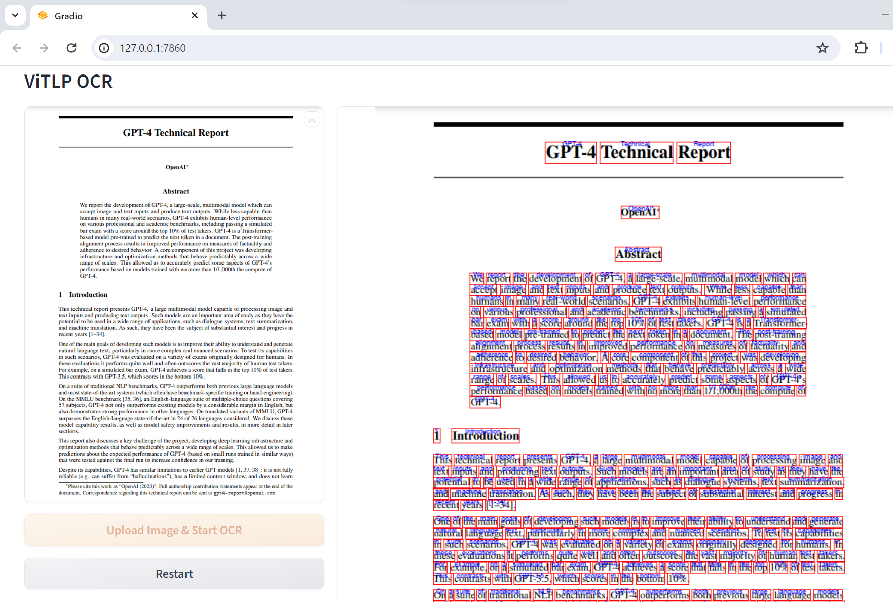
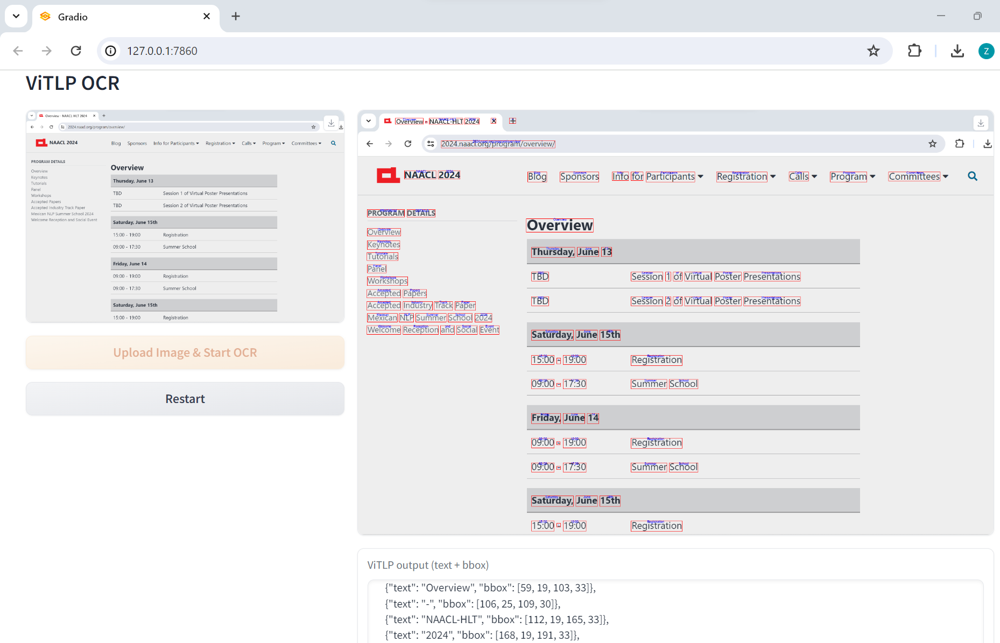

# ViTLP
This repository releases code of paper [**Visually Guided Generative Text-Layout Pre-training for Document Intelligence** (NAACL-2024)](https://aclanthology.org/2024.naacl-long.264.pdf).


We provide the pre-trained checkpoint **ViTLP-medium** (380M). The pre-trained ViTLP model can natively perform OCR text localization and recognition, which is accessible at [Huggingface](https://huggingface.co/veason/ViTLP-medium/tree/main). Clone (or download) ViTLP checkpoint weight to the directory `./ckpts/ViTLP-medium`.

<pre><code>git clone ViTLP && cd ViTLP
pip install -r requirements.txt

# Clone ViTLP-medium checkpoint
mkdir -p ckpts/ViTLP-medium
git clone https://huggingface.co/veason/ViTLP-medium ckpts/ViTLP-medium</code></pre>


# Demo
With the checkpoint and dependencies set (see requirements.txt), run the demo as

<pre><code>python ocr.py</code></pre>

Upload a document image and have a shot.





See detailed inference code at `decode.py` and run batch decode by

<pre><code>bash decode.sh</code></pre>


# Fine-tuning ViTLP
Please refer to [./finetuning](https://github.com/Veason-silverbullet/ViTLP/tree/main/finetuning) for post-training on OCR datasets and fine-tuning on VQA datasets.

We also release a tool for synthesizing documents with grounding-box metadata at [./finetuning/SynthDog-bbox](https://github.com/Veason-silverbullet/ViTLP/tree/main/finetuning/SynthDog-bbox).


# Preset FAQ
- Why is ViTLP-medium (380M)?

  When I commenced this project, it was on the eve of LLMs (precisely speaking, ChatGPT). ViTLP-base presented in our paper, is actually a rather small pre-trained model. We know it is expected to scale up ViTLP in this LLM era. However, the pre-training scale is commonly constrained by computation resources and the pre-training dataset scale, in which context ViTLP-medium (380M) is the largest pre-training scale so far we can support.

  Besides, this scale of ViTLP also brings inference sweetness including speed and memory usage. Typically, OCR on a page of a document image can be processed within 5~10 seconds in an Nvidia 4090, which is comparable to (and faster than) most OCR engines (and LLMs).


## Citation
```
@inproceedings{mao-etal-ViTLP,
    title = "Visually Guided Generative Text-Layout Pre-training for Document Intelligence",
    author = "Mao, Zhiming  and
              Bai, Haoli  and
              Hou, Lu  and
              Shang, Lifeng  and
              Jiang, Xin  and
              Liu, Qun  and
              Wong, Kam-Fai",
    editor = "Duh, Kevin  and
              Gomez, Helena  and
              Bethard, Steven",
    booktitle = "Proceedings of the 2024 Conference of the North American Chapter of the Association for Computational Linguistics: Human Language Technologies (Volume 1: Long Papers)",
    month = jun,
    year = "2024",
    address = "Mexico City, Mexico",
    publisher = "Association for Computational Linguistics",
    url = "https://aclanthology.org/2024.naacl-long.264",
    pages = "4713--4730"
}
```


# Note
ViTLP is pronounced /ˈvai·tlp/ (vital). The first version of our paper was submitted to [OpenReview](https://openreview.net/forum?id=ARtBIBAmNR) in June 2023.
