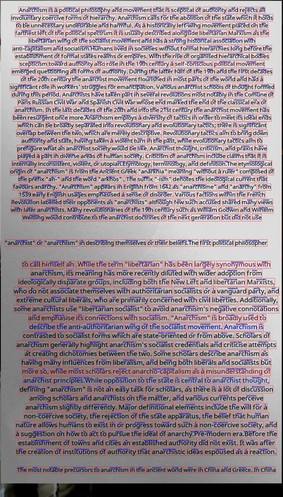

# Synthesized Documents with Bounding Boxes
Besides ViTLP, we also provide a tool to generate synthetic documents with word- and line-level bounding boxes. This generator tool is developed based on [SynthDog](https://github.com/clovaai/donut/tree/master/synthdog).

## Resource Preparation
- For text corpus, we leveraged [English Wikipedia Corpus](https://dumps.wikimedia.org/enwiki/) to generate ViTLP pre-training data.

- For text fonts, we used 10+ fonts to improve the content diversity of ViTLP pre-training data. See `./resources/font`.

- For document paper background, we used 1000-class ImageNet and MS COCO images as background to improve the content diversity of ViTLP pre-training data. See `./resources/background`.

- For generation config, we set the high-resolution document parameters at `./config.yaml`.

- For package requirements, `pip install synthtiger Pillow==9.5.0`.

## Usage
For example, to render 10 documents with bboxes (run `./generate_data.sh`):

<pre><code>synthtiger -o synthetic_images -c 10 -v template.py SynthDoG config.yaml</code></pre>

The generated images and corresponding metadata are at `./synthetic_images`.

## Generated Data Format
- The generated metadata contains document words with region/line/word-level bounding boxes. The nested format is arranged as 

    `[[[[[[word, [word_x1, word_y1, word_x2, word_y2]]...], [line_x1, line_y1, line_x2, line_y2]]...], [region_x1, region_y1, region_x2, region_y2]]...]`

    Decode the metadata:
  <pre><code>with open('synthetic_images/ocr_0.pkl', 'rb') as f:
      metadata = pickle.load(f)
  
  for (region_data, (region_x1, region_y1, region_x2, region_y2)) in metadata:
      print(f'Region-level bbox: [{region_x1}, {region_y1}, {region_x2}, {region_y2}]')
      for (line_data, (line_x1, line_x2, line_y1, line_y2)) in region_data:
          print(f'Line-level bbox: [{line_x1}, {line_y1}, {line_x2}, {line_y2}]')
          for (word, (word_x1, word_y1, word_x2, word_y2)) in line_data:
              print(f'Word: {word}\tBbox: [{word_x1}, {word_y1}, {word_x2}, {word_y2}]')</code></pre>

- Preprocess the metadata for training ViTLP:
  <pre><code>python preprocess.py</code></pre>

  The preprocessed readable JSON-format data and image are at [./preprocessed_data/data](https://github.com/Veason-silverbullet/ViTLP/tree/main/finetuning/SynthDog-bbox/preprocessed_data/data) and [./preprocessed_data/images](https://github.com/Veason-silverbullet/ViTLP/tree/main/finetuning/SynthDog-bbox/preprocessed_data/images).

  Bounding box visualization, e.g., [./preprocessed_data/visualization/image_0.jpg](https://github.com/Veason-silverbullet/ViTLP/tree/main/finetuning/SynthDog-bbox/preprocessed_data/visualization/image_0.jpg):
  

## Acknowledgement
This tool is developed upon [SynthDog](https://github.com/clovaai/donut/tree/master/synthdog) which should own the most credit.
